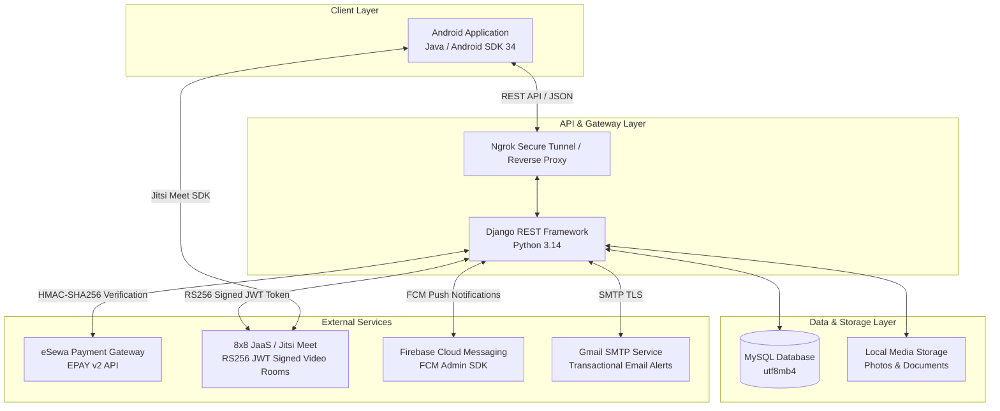

# UniAssist 🎓

[](https://09kushal.github.io/UniAssist/)
[-blue?style=for-the-badge&logo=android&logoColor=white)](https://github.com/09kushal/UniAssist/releases/download/v1.0.0/UniAssist-v1.0.apk)
[](https://github.com/09kushal/UniAssist)
[](https://github.com/09kushal/UniAssist)
[](https://github.com/09kushal)
[](https://github.com/09kushal/UniAssist)

> 🌐 **Live Web Showcase & Interactive Mobile Simulator**: [https://09kushal.github.io/UniAssist/](https://09kushal.github.io/UniAssist/)  
> 📥 **Direct APK Download**: [Download UniAssist-v1.0.apk](https://github.com/09kushal/UniAssist/releases/download/v1.0.0/UniAssist-v1.0.apk) (Ready to install on Android 8.0+)

**UniAssist** is an on-demand peer-tutoring and academic consultation platform connecting university students with verified student tutors. It features end-to-end booking workflows, secure digital payments via eSewa, live encrypted video sessions powered by 8x8 JaaS (Jitsi as a Service), Firebase Cloud Messaging (FCM) push notifications, and dispute/lateness reporting.


---

## 🌟 Key Features

### 👨‍🎓 For Students
- **Tutor Discovery & Filtering**: Search tutors by subject, hourly rate, rating, and availability status.
- **Booking Management**: Request 1-on-1 tutoring sessions with custom dates, start times, and duration (hours).
- **Seamless Digital Payment**: Integrated eSewa payment gateway with automatic signature generation and HMAC-SHA256 verification.
- **HD Video Sessions**: In-app 1-click Jitsi Meet video conferencing with JWT authentication and strict time-window enforcement.
- **Reviews & Ratings**: Rate tutors and write feedback after session completion.
- **Lateness & Issue Reporting**: Report late/no-show tutors directly from booking cards with automatic dispute logging and direct WhatsApp administrator escalation.
- **Push & In-App Notifications**: Real-time push alerts on booking approvals, session reminders, payment confirmations, and swipe-to-delete notification tray.

### 👩‍🏫 For Tutors
- **Tutor Profile & Verification**: Upload profile photo, subject expertise chips, bio, hourly pricing, and academic verification documents.
- **Availability Management**: Define custom recurring weekly availability time-slots.
- **Booking Requests Dashboard**: Real-time incoming session requests with Accept/Reject actions and reason dialogues.
- **Live Video Launch**: Direct room entry with moderator privileges once booking start time arrives.
- **Payout & Earnings Tracking**: Transparent earnings summary and automated payout requests to admin.

### 🛡️ Administrator & Platform Management
- **Django Admin Portal**: Comprehensive management of users, tutor verification statuses, bookings, and disputes.
- **Escrow & Bulk Payout Release**: Admin action to verify completed sessions and batch-release payouts to tutors.
- **Self-Healing Session Expiration**: Background check that automatically flags past unattended bookings as `expired` to keep dashboards clean.

---

## 🏗️ System Architecture



---

## 🛠️ Technology Stack

| Layer | Technologies |
| :--- | :--- |
| **Mobile App (Android)** | Java, XML, Material Design Components, Retrofit 2, OkHttp 3, Jitsi Meet SDK, Firebase Messaging SDK, Glide |
| **Backend Framework** | Python, Django 5.x / 6.x, Django REST Framework (DRF), Django CORS Headers |
| **Database** | MySQL 8.x / 9.x (`utf8mb4_unicode_ci`), Django ORM |
| **Video Calling** | JaaS (8x8 Jitsi as a Service) with private key RS256 token signing (`PyJWT`, `cryptography`) |
| **Payment Gateway** | eSewa EPAY v2 Integration (HMAC-SHA256 signature generation and base64 response decode) |
| **Push Notifications** | Firebase Cloud Messaging (`firebase-admin`) |
| **Email Service** | Django SMTP with Gmail App Password authentication |

---

## 📂 Repository Structure

```text
UniAssist/
├── android/
│   └── UniAssist/
│       ├── app/
│       │   ├── src/main/
│       │   │   ├── java/com/kushal/uniassist/   # Activities, Adapters, Models, Network Services
│       │   │   ├── res/layout/                  # XML UI Layouts (Activities, Items, Dialogs)
│       │   │   └── AndroidManifest.xml
│       │   ├── google-services.json             # Firebase Android configuration
│       │   └── build.gradle
│       └── build.gradle
├── backend/
│   ├── accounts/                                # Custom User model, Auth, Registration, Profiles
│   ├── booking/                                 # Booking requests, sessions, expiration utilities
│   ├── payments/                                # eSewa payment initiation, verification, and payouts
│   ├── reports/                                 # Lateness reports, disputes, admin tracking
│   ├── reviews/                                 # Tutor rating and review system
│   ├── notifications/                           # FCM push service, notification models & APIs
│   ├── tutors/                                  # Tutor profiles, availability slots, verification
│   ├── uniassist/                               # Settings, root URLs, WSGI configuration
│   ├── .env.example                             # Environment variable template
│   └── manage.py
├── requirements.txt                             # Python backend dependencies
└── README.md
```

---

## 🚀 Quick Start & Setup Guide

### 1. Backend Setup

1. **Clone the repository**:
   ```bash
   git clone https://github.com/09kushal/UniAssist.git
   cd UniAssist
   ```

2. **Create and activate a virtual environment**:
   ```bash
   python3 -m venv venv
   source venv/bin/activate
   ```

3. **Install dependencies**:
   ```bash
   pip install -r requirements.txt
   ```

4. **Configure Environment Variables**:
   ```bash
   cp backend/.env.example backend/.env
   # Edit backend/.env with your MySQL credentials, Gmail SMTP, and JaaS configuration
   ```

5. **Setup MySQL Database & Run Migrations**:
   ```bash
   mysql -u root -p -e "CREATE DATABASE uniassist_db CHARACTER SET utf8mb4 COLLATE utf8mb4_unicode_ci;"
   python backend/manage.py migrate
   ```

6. **Start the Django Development Server**:
   ```bash
   cd backend
   python manage.py runserver 0.0.0.0:8000
   ```
   > **Quick Alias**: You can add this shortcut to your `~/.zshrc` to launch the server instantly by typing `uniassist`:
   > ```bash
   > alias uniassist='source ~/UniAssist/venv/bin/activate && cd ~/UniAssist/backend && python manage.py runserver 0.0.0.0:8000'
   > ```

7. **Start Ngrok (for Physical Android Device Testing)**:
   ```bash
   ngrok http --url=yin-elongated-studio.ngrok-free.dev 8000
   ```

---

### 2. Android App Setup

1. Open **Android Studio**.
2. Select **Open an Existing Project** and navigate to `UniAssist/android/UniAssist`.
3. Allow Gradle to sync dependencies.
4. In `ApiClient.java`, verify that `BASE_URL` matches your local server or Ngrok URL:
   ```java
   private static final String BASE_URL = "https://yin-elongated-studio.ngrok-free.dev/";
   ```
5. Build and run on an Android device or emulator (Android 8.0+ / API 26+).

---

## 📜 License & Portfolio Notice

This repository is maintained as a public software portfolio showcase demonstrating full-stack Android & Django engineering, clean architecture, payment gateway integration, and real-time WebRTC communication.
